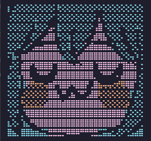

# 🌸 Catppuccin Mocha Terminal

Unified Catppuccin Mocha theme setup for Windows Terminal, Windows PowerShell, PowerShell 7, and Command Prompt (cmd.exe) with Fastfetch, Oh My Posh, and Clink.

[](https://github.com/krambovic/catppuccin-terminal)
[](https://github.com/krambovic/catppuccin-terminal)
[](https://github.com/catppuccin/catppuccin)
[](LICENSE)

<br />

<p align="center">
  
</p>

---

## 📋 Requirements

- **Operating System:** Windows 10 (version 1809 or higher) or Windows 11
- **Terminal:** [Windows Terminal](https://aka.ms/terminal) (recommended)
- **Package Manager:** `winget` (Windows Package Manager, included with Windows 11 and modern Windows 10)

The installer will automatically install and configure:
- **Fastfetch** (System information tool)
- **Oh My Posh** (Prompt engine)
- **Clink** (Command Prompt enhancements and readline support)
- **JetBrains Mono Nerd Font** (Nerd Font glyphs)

---

## ✨ Installation

### ⚡ Method 1: Automatic One-Liner (Recommended)

Open **PowerShell** and run the following command:

```powershell
irm https://raw.githubusercontent.com/krambovic/catppuccin-terminal/main/install.ps1 | iex
```

### 📦 Method 2: Manual Clone

Clone the repository and run the installer script locally:

```powershell
git clone https://github.com/krambovic/catppuccin-terminal.git
cd catppuccin-terminal
powershell -ExecutionPolicy Bypass -File .\install.ps1
```

### 💫 After Installation

1. Close all active Windows Terminal, PowerShell, and Command Prompt windows.
2. Launch a new Windows Terminal window.
3. Both **PowerShell** and **Command Prompt** will start with the Catppuccin Mocha Fastfetch banner and Oh My Posh prompt.

---

## 🧹 Uninstallation

To revert all changes, restore your previous profiles, and clean up the configuration files:

```powershell
irm https://raw.githubusercontent.com/krambovic/catppuccin-terminal/main/uninstall.ps1 | iex
```

Or from a local clone:

```powershell
powershell -ExecutionPolicy Bypass -File .\uninstall.ps1
```

Original configuration backups are preserved in `~/catppuccin-terminal-backups/`.

---

## 📄 License

This project is licensed under the [MIT License](LICENSE).
